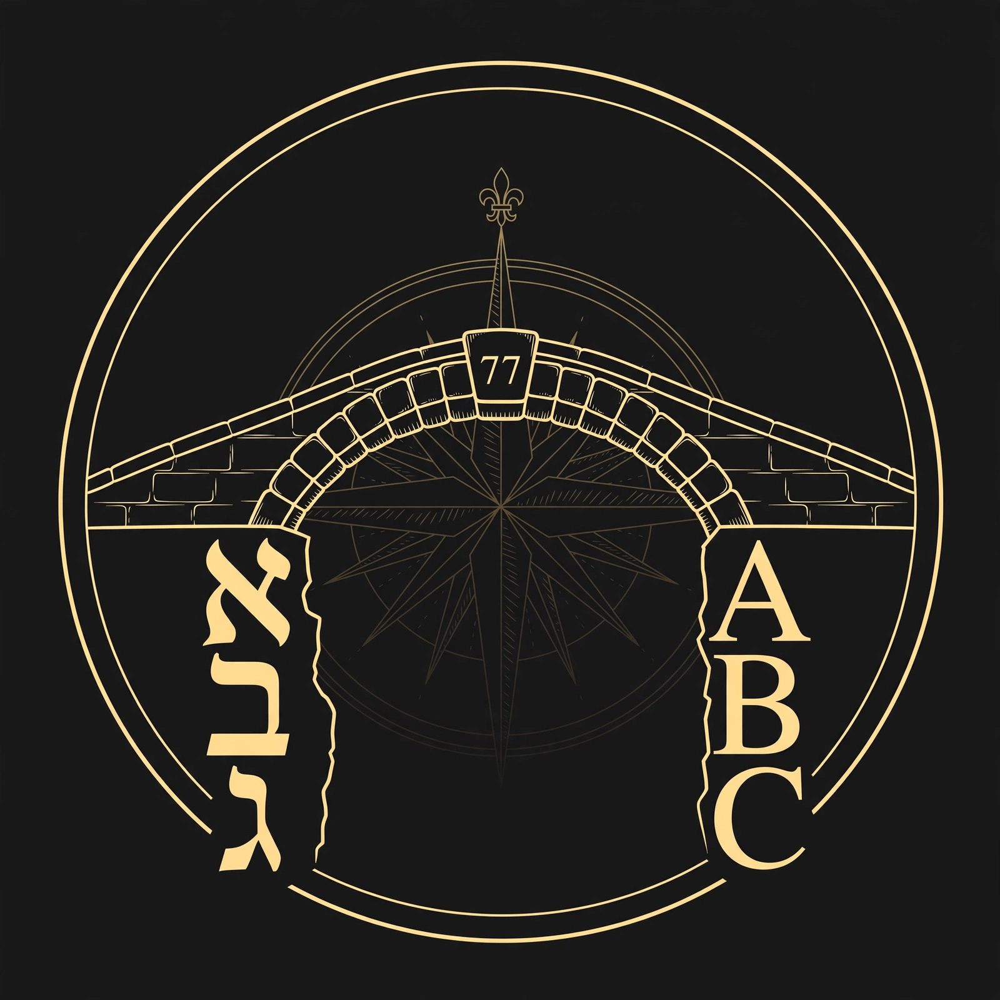

# PONTIFEX — the Universal Language Gematria Cartographer

*The bridge-builder. v0.3.0 "The Third Span."*



> "If I have seen further it is by standing on the shoulders of Giants."
> — Isaac Newton, 1676

## Intention

To build the universal map of gematria across all tongues — every script weighed, every bridge charted, the convergent and divergent points mapped diligently. No tongue left without a table; no table without its provenance; no bridge claimed without its audit trail.

## Purpose

Gematria's *method* is to weigh each word in its own tongue. Its *purpose* is the bridge — the match across tongues. The shared number is the bridge, and a bridge needs two honest banks. PONTIFEX is the instrument for that work: it weighs, it compares, and it tells you whether what converged is a candidate bridge or a hypothesis for the red pen.

## Doctrine (the author's; settled 2026-10-07)

- **Method vs purpose.** Compute each word in its own tongue's table — you cannot honestly put Hebrew values on Latin letters. The revelation is the match: AXONEME = 77 in English ordinal, עז = 77 in Hebrew. Two tongues, one number — that shared 77 *is* the bridge.
- **Numbering follows the name.** A liber's number derives from its title's gematria (CELL = 32 → Liber XXXII; Oz = 77 → Liber LXXVII). Rename or renumber must follow the name.
- **Hebrew is the proper fallback** for tongues with no table of their own — the tradition's own move (foreign words transliterated into Hebrew), and the correspondence engine is Hebrew-rooted, so bridges must land in that engine. English ordinal is native for English words, not the fallback for others. Transliteration is lossy (mergers where scripts exceed 22 letters) — the mapping documents every merger.
- **Braille as carrier.** 64 dot-patterns swallow most alphabets whole — a lossless carrier where Hebrew would merge. Its values (1–64, canonical order) are the scribe's construction: transparent, consistent, never a discovery.
- **Three-tier provenance.** ATTESTED (tradition) / DERIVED (script-descent) / CONSTRUCTED (built, method documented). Convergent points on attested tables are candidate bridges; convergent points touching the constructed tier are hypotheses for the author's red pen — never doctrine until they pass TRVVTH.

## The name

PONTIFEX is Latin for *bridge-builder* — proposed by the scribe, approved by the author's red pen 2026-10-07. The doctrine is the author's; the mechanisms are not.

## Usage

```bash
python3 -m pontifex weigh CELL latin_ordinal
python3 -m pontifex bridge AXONEME latin_ordinal עז hebrew
python3 -m pontifex fallback cell        # Hebrew fallback, mergers shown
python3 -m pontifex music "C E G"        # ABC notation or bare notes
python3 -m pontifex selftest            # the instrument checks itself first
```

Systems: `hebrew`, `greek`, `latin_ordinal`, `agrippa`, `arabic_abjad`, `braille`, `abc_notes`.

## API

Three doors into the same engine — see [API.md](API.md) for the full reference:

- **Python:** `import pontifex` — `weigh()`, `bridge()`, `weigh_melody()`, `weigh_via_hebrew_fallback()`, `self_test()`.
- **CLI:** `python -m pontifex ...` with `--json` anywhere for machine output; exit codes are a contract (0 = converged, 3 = diverged, 1 = error).
- **HTTP:** `python -m pontifex serve` — loopback-only JSON API (`/weigh`, `/bridge`, `/music`, `/fallback`, `/systems`, `/selftest`).

## The music bridge

Note names in the English letter tradition *are* Latin letters, so their values fall out of the attested Latin ordinal — C=3, D=4, E=5, F=6, G=7, A=1, B=2. A melody is a word spelled in notes. ABC notation is the input format: a real, parseable corpus of thousands of tunes.

Extraction conventions (stated, constructed): accidentals sharp +1 / flat −1 / natural +0; octave markers dropped (pitch-class level); durations ignored; chords weighed note by note; rests are silence. See [METHOD.md](METHOD.md) §7.

## Method

See [METHOD.md](METHOD.md) — the three tiers, the fallback doctrine, the two-column bridge-table, and the honest limits (CJK ordering, sign handshapes).

## Standing

- v0.1 maps the weighing; the full cross-language correspondence atlas is the work ahead.
- No LICENSE — see "All Rights Reserved, Without Prejudice" below.

---

Johnathan 'Qasparr' (Κασπάρρ) Monroe, Keeper of the Secret Treasure
All Rights Reserved, Without Prejudice.
"Live, Love, and let Love, Live." 93.
